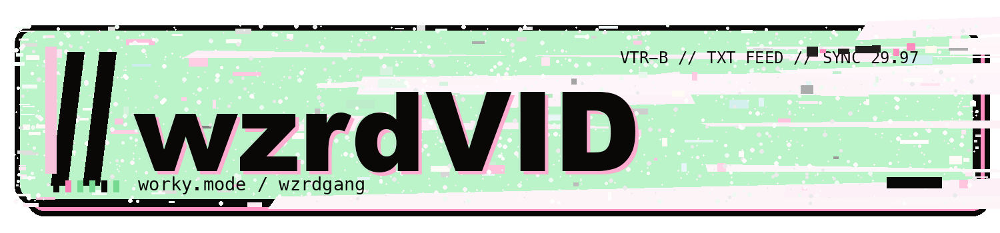

# //wzrdVID



**ANSI motion lab // lo-fi frames // cursed little files**

//wzrdVID is a local macOS textmode/glitch/compression-art video engine. It turns videos and photos into strange compressed little objects: ANSI motion, chunky blocks, terminal drift, VHS damage, ugly cuts, audio-reactive hits, and phone-sendable MP4s.

It is inspired by ANSI graphics, late-night cable TV, old internet media tools, lo-fi broadcast artifacts, public-access video, tape labels, and underground mixtape utility software. The point is simple: give your clips the Sam treatment, remix the pipeline, and ship weird little files.

The output is a normal `.mp4`. It visually looks like terminal/video-art output, but it is not a terminal playback file.


## Download Options

If you just want to use the app, do **not** use GitHub's green **Code -> Download ZIP** button. That ZIP is only the source code.

Use the packaged app download instead:

[Download WZRD.VID from GitHub Releases](https://github.com/wzrdgang/wzrdVID/releases)

### Option A - Download the Mac app

For most people:

1. Go to **Releases** on GitHub.
2. Download `WZRD.VID-macOS.zip`.
3. Unzip it.
4. Open `WZRD.VID.app`.

Notes:

- The GitHub **Code -> Download ZIP** button is source code only. It does not include the packaged `WZRD.VID.app` because build output is intentionally ignored.
- If macOS blocks the app because it is unsigned or unnotarized, right-click `WZRD.VID.app` and choose **Open**.
- `ffmpeg` and `ffprobe` are still required unless/until they are bundled. Install them with:

```bash
brew install ffmpeg
```

### Option B - Run from source ZIP

The GitHub source ZIP is only about a few MB because it excludes build output.

```bash
cd ~/Downloads/wzrdVID-main
brew install ffmpeg
python3 -m venv .venv
source .venv/bin/activate
pip install -r requirements.txt
./run.sh
```

### Option C - Build the Mac app locally

```bash
cd ~/Downloads/wzrdVID-main
brew install ffmpeg
./build_app.sh
open "dist/WZRD.VID.app"
```

## Features

- Multi-source timeline for videos and photos.
- Photo holds with the same ANSI/chunky/effects pipeline as video.
- Music/audio from audio files or video files with audio tracks.
- Per-source **Include Audio** controls for timeline video rows.
- Audio modes: Silent, External only, Source audio only, External + selected source audio.
- Trim controls for timeline and music/audio.
- Match visual timeline length to selected music by retiming, trimming, or looping.
- ANSI/text-art rendering with color sampled from source frames.
- Chunky block styles, symbol ANSI styles, dither modes, scanlines, RGB split, glitch, VHS wobble, tunnel zoom, stutter holds, motion melt, tape damage, and mosaic collapse.
- Canvas/framing controls for vertical clips: fill/crop, fit/letterbox, smart portrait, stretch, anchors, offsets, crop zoom, and letterbox backgrounds.
- Bypass-normal sections so chosen parts remain regular video instead of ANSI.
- Transitions and endings for less-abrupt exports.
- Batch variants for multiple outputs from one timeline.
- Output-size presets, including 29 MB Text Limit and 32 MB Sweet Spot workflows.
- Auto-optimize final video size with H.264 `yuv420p`, AAC, and `+faststart`.
- PyInstaller macOS app build support.

## Screenshots / Demos

Brand preview:


Public screenshots, GIFs, demo presets, and small generated examples can live under `examples/`. This repository intentionally does not include copyrighted sample media.

## Requirements

- macOS on Apple Silicon or Intel
- Python 3.10 or newer
- ffmpeg and ffprobe

Install ffmpeg with Homebrew:

```bash
brew install ffmpeg
```

## Install And Run

```bash
python3 -m venv .venv
source .venv/bin/activate
pip install -r requirements.txt
./run.sh
```

You can also run directly after installing requirements:

```bash
python app.py
```

The app checks for `ffmpeg` and `ffprobe` at startup and shows the Homebrew install command if either is missing.

## Build The macOS App

```bash
./build_app.sh
```

Output:

```text
dist/WZRD.VID.app
```

The build script regenerates branding assets, icon assets, UI textures, then packages the app with PyInstaller. The Finder/Dock icon comes from `assets/wzrd_vid.icns`.

## Workflow

1. Add videos and/or photos in **Sources / Timeline**.
2. Set video trim points or photo hold durations.
3. Select optional external music/audio. Video containers such as `.mp4` or `.mov` can be used as audio sources when they contain an audio track.
4. Choose Audio Mix mode and per-video **Include Audio** rows.
5. Set timeline/music trim, match-to-music behavior, and Canvas / Framing.
6. Pick an ANSI/chunky style, dither mode, effects, transitions, and ending mode.
7. Choose ANSI Coverage if you want some sections to stay normal video.
8. Pick Output Size and optional Optimize Output target.
9. Use **Preview 5 Sec** for a quick sample, then **MAKE VIDEO** or **MAKE BATCH**.

Project presets save timeline items, media paths, trims, audio settings, framing, styles, effects, bypass sections, seeds, optimization, and batch selections as JSON.

## Audio

Audio Mix modes:

- **Silent**: final MP4 has no audio stream.
- **External only**: uses the selected audio file or audio track from a selected video container.
- **Source audio only**: uses checked **Include Audio** timeline video rows; unchecked clips, clips without audio, and photo sections become silence.
- **External + selected source audio**: mixes external audio with checked source-video audio and muxes AAC into the final MP4.

If no external music is selected and timeline source audio is available, WZRD.VID defaults to source audio. If external audio is selected, it defaults to external only.

When **Match video length to music** is enabled, external audio is the timing authority. Source audio mixing is disabled for retimed match-to-music renders in this build; the app logs a warning and uses external audio only.

## Output Size And Optimization

ANSI/text-art video has lots of tiny high-contrast detail, so it can compress poorly. WZRD.VID separates character detail from final MP4 size:

- Character width controls the text-art grid.
- Output Size controls final width, FPS, CRF, and AAC bitrate.
- Optimize Output can create a separate size-targeted copy.

Built-in output presets include Full Quality, Social Share, Text Message Small, Text Message Tiny, and Custom. Built-in optimization presets include 29 MB Text Limit, 32 MB Sweet Spot, and 50 MB Better Quality.

## Branding System

The //wzrdVID identity is generated by `scripts/generate_branding.py`. It exports a primary wordmark, compact mark, app icon source, monochrome mark, tiny slash mark, SVG masters, and a preview sheet under `assets/branding/`.

Regenerate branding and icons:

```bash
python3 scripts/generate_branding.py
python3 scripts/generate_icon.py
```

## Rights / Branding

WZRD.VID source code is licensed under AGPL-3.0. You may use, study, modify, and share the source code under that license.

//wzrdVID branding, logos, and visual identity are reserved by Sam Howell. The source code license does not grant trademark rights or permission to use official branding in a way that implies endorsement, official status, or a competing branded product.

Forks, remixes, and experiments are welcome. If you redistribute a modified build publicly, use your own name/branding unless you have permission to use the official //wzrdVID identity.

Commercial licensing, branded redistribution, paid integrations, custom builds, and support are available by arrangement.

## Not Included

- No copyrighted sample media.
- No bundled commercial music or video.
- No rights to media you process.

You are responsible for the rights to any video, photo, or audio you import, render, post, remix, or redistribute.


## Troubleshooting

- If the app will not open, right-click `WZRD.VID.app` and choose **Open**. This is common for unsigned or unnotarized local builds.
- If `ffmpeg` or `ffprobe` is missing, install them with `brew install ffmpeg`.
- If you are running from source, install requirements first and launch with `./run.sh`.
- If you downloaded the GitHub source ZIP and expected an app bundle, use the GitHub Releases download instead. The source ZIP does not include `dist/WZRD.VID.app`.

## Contributing

See `CONTRIBUTING.md`. Focused PRs are welcome. Please preserve the app’s identity, performance, readability, and local-first workflow.

## Security

See `SECURITY.md` for vulnerability reporting.

## License

Source code: AGPL-3.0. See `LICENSE`.

Branding/trademarks: reserved. See `NOTICE.md`.

Third-party notices: see `THIRD_PARTY_NOTICES.md`.
