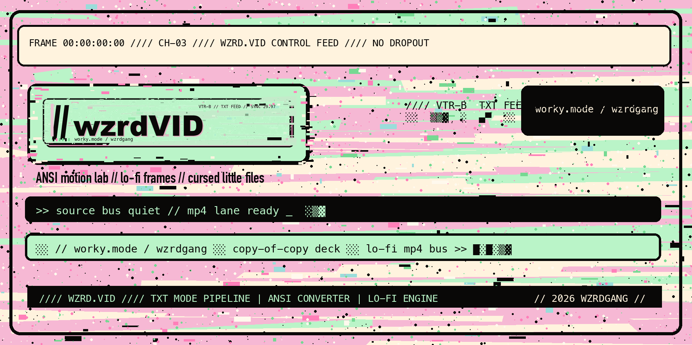
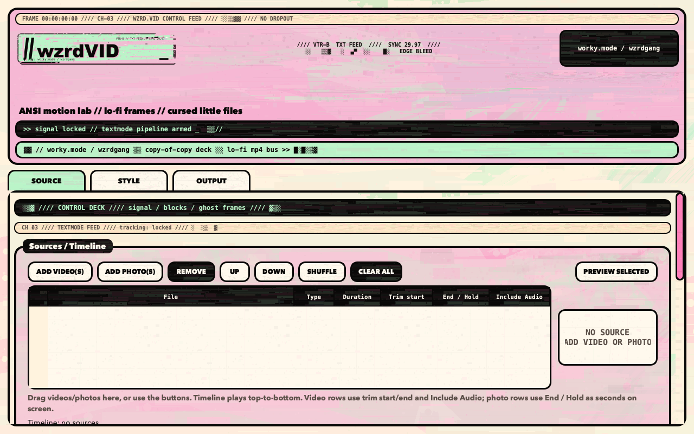
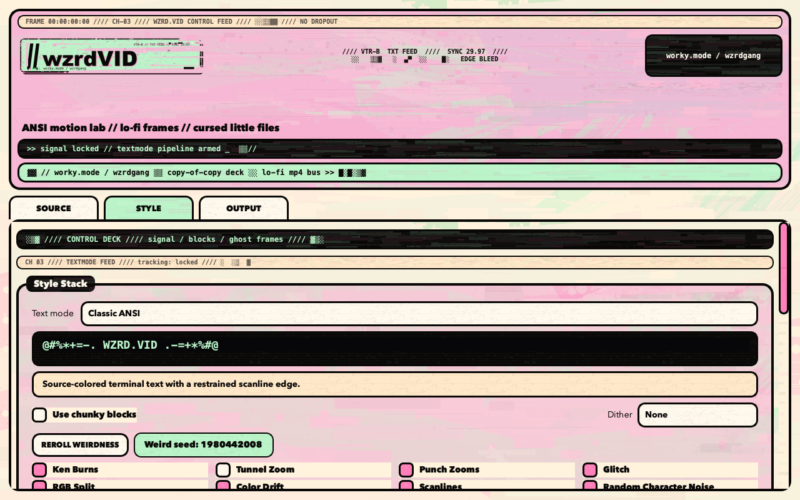
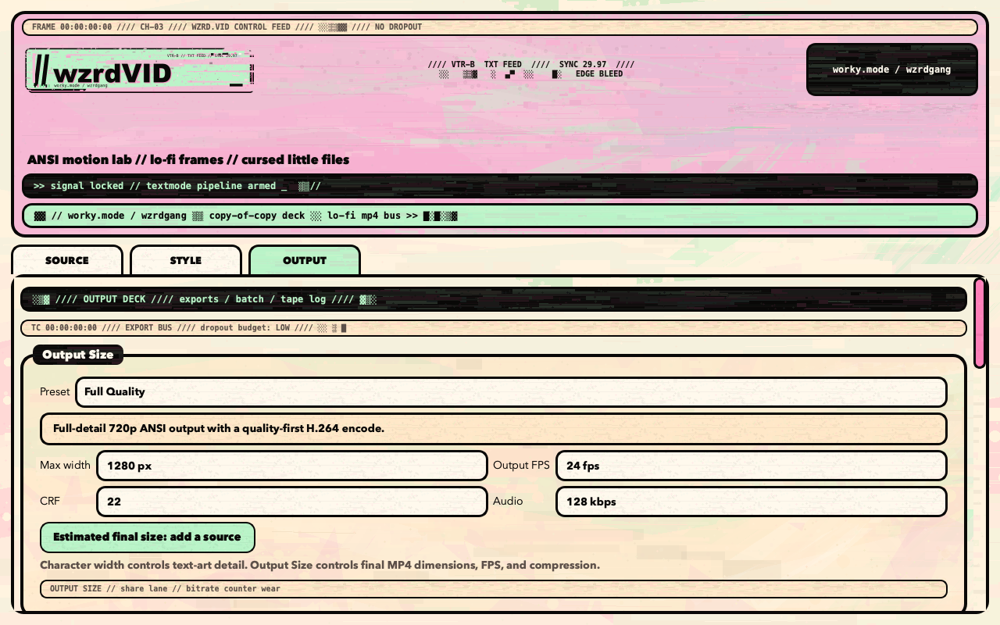
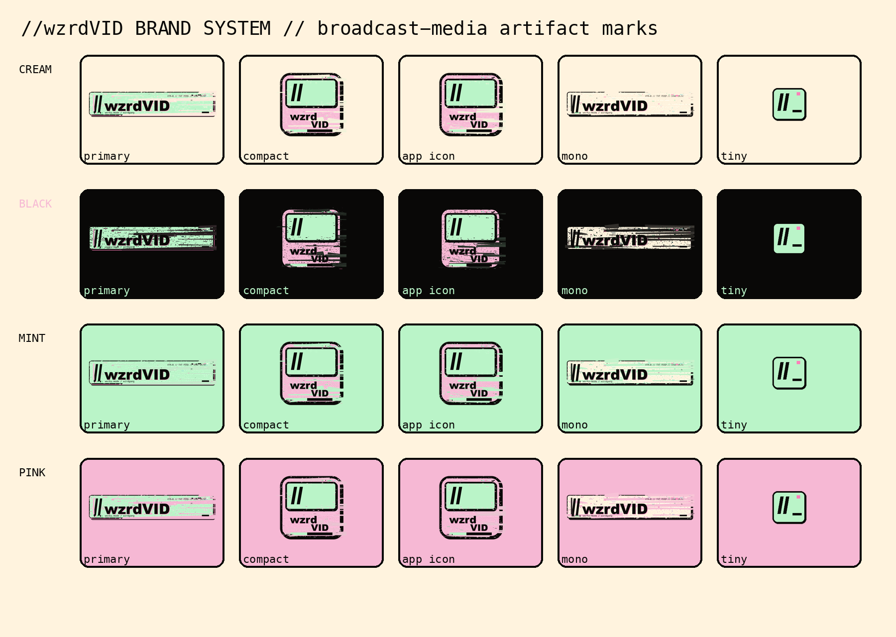

# //wzrdVID

<p align="center">
  
</p>

**ANSI motion lab // lo-fi frames // cursed little files**

//wzrdVID is a local desktop textmode/glitch/compression-art video engine. It turns videos and photos into strange compressed little objects: ANSI motion, chunky blocks, terminal drift, VHS damage, ugly cuts, audio-reactive hits, and phone-sendable MP4s.

It is inspired by ANSI graphics, late-night cable TV, old internet media tools, lo-fi broadcast artifacts, public-access video, tape labels, and underground mixtape utility software. The point is simple: give your clips the worky treatment, remix the pipeline, and ship weird little files.

The output is a normal `.mp4`. It visually looks like terminal/video-art output, but it is not a terminal playback file.


## Download Options

If you just want to use the app on macOS, do **not** use GitHub's green **Code -> Download ZIP** button. That ZIP is only the source code.

Use the packaged app download instead:

[Download WZRD.VID from GitHub Releases](https://github.com/wzrdgang/wzrdVID/releases)

### Option A - Download the Mac app

For most macOS users:

1. Go to **Releases** on GitHub.
2. Download `WZRD.VID-macOS.zip`.
3. Unzip it.
4. Open `WZRD.VID.app`.

Notes:

- The GitHub **Code -> Download ZIP** button is source code only. It does not include the packaged `WZRD.VID.app` because build output is intentionally ignored.
- If macOS blocks the app because it is unsigned or unnotarized, right-click `WZRD.VID.app` and choose **Open**.
- `ffmpeg` and `ffprobe` are still required unless/until they are bundled. Install them with `brew install ffmpeg`.

### Option B - Run from source ZIP

The GitHub source ZIP is only about a few MB because it excludes build output. Windows and Linux users should use this path for now. Install ffmpeg first using the platform notes below.

macOS/Linux:

```bash
cd ~/Downloads/wzrdVID-main
python3 -m venv .venv
source .venv/bin/activate
pip install -r requirements.txt
python run.py
```

Windows PowerShell:

```powershell
cd $env:USERPROFILE\Downloads\wzrdVID-main
py -m venv .venv
.venv\Scripts\Activate.ps1
pip install -r requirements.txt
python run.py
```

Windows Command Prompt:

```bat
cd %USERPROFILE%\Downloads\wzrdVID-main
py -m venv .venv
.venv\Scripts\activate.bat
pip install -r requirements.txt
python run.py
```

### Option C - Build the Mac app locally

```bash
cd ~/Downloads/wzrdVID-main
brew install ffmpeg
./build_app.sh
open "dist/WZRD.VID.app"
```

## Updating WZRD.VID

macOS app users:

1. Download the latest `WZRD.VID-macOS.zip` from GitHub Releases.
2. Unzip it.
3. Replace your old `WZRD.VID.app` with the new one.

Source users:

1. Pull the latest changes or redownload the source ZIP.
2. Reactivate your virtual environment.
3. Run `pip install -r requirements.txt`.

## Platform Support

WZRD.VID is currently tested primarily on macOS.

Linux and Windows users can usually run from source with Python + ffmpeg. Cross-platform source runs are best-effort/experimental, and packaged Windows/Linux builds are not currently provided.

Install ffmpeg/ffprobe for your platform:

macOS:

```bash
brew install ffmpeg
```

Debian/Ubuntu:

```bash
sudo apt update
sudo apt install ffmpeg
```

Fedora:

```bash
sudo dnf install ffmpeg
```

Arch:

```bash
sudo pacman -S ffmpeg
```

Windows:

```powershell
winget install Gyan.FFmpeg
```

Or download from <https://ffmpeg.org/download.html>. Make sure `ffmpeg.exe` and `ffprobe.exe` are on PATH.

See `docs/CROSS_PLATFORM.md` for more source-run details and known caveats.

## Requirements

- Python 3.10 or newer
- ffmpeg and ffprobe
- Python dependencies from `requirements.txt`

## Install And Run

macOS/Linux:

```bash
python3 -m venv .venv
source .venv/bin/activate
pip install -r requirements.txt
python run.py
```

Windows PowerShell:

```powershell
py -m venv .venv
.venv\Scripts\Activate.ps1
pip install -r requirements.txt
python run.py
```

Windows Command Prompt:

```bat
py -m venv .venv
.venv\Scripts\activate.bat
pip install -r requirements.txt
python run.py
```

Convenience launchers are also included:

- macOS/Linux: `./run.sh`
- Windows: `run_windows.bat`

The app checks for `ffmpeg` and `ffprobe` at startup and shows platform-specific install guidance if either is missing.

## Build The macOS App

```bash
./build_app.sh
```

Output:

```text
dist/WZRD.VID.app
```

The build script regenerates branding assets, icon assets, UI textures, then packages the app with PyInstaller. The Finder/Dock icon comes from `assets/wzrd_vid.icns`.

## Features

- Multi-source timeline for videos and photos, with drag-and-drop into the Sources / Timeline table.
- Photo holds with the same ANSI/chunky/effects pipeline as video, including automatic EXIF orientation correction for phone photos.
- Music/audio from audio files or video files with audio tracks, selectable by picker or drag-and-drop.
- Per-source **Include Audio** controls for timeline video rows.
- Audio modes: Silent, External only, Source audio only, External + selected source audio.
- Trim controls for timeline and music/audio, plus Music Start In Video / Music End In Video offsets for delayed external audio.
- Match visual timeline length to selected music by retiming, trimming, or looping.
- ANSI/text-art rendering with color sampled from source frames.
- Chunky block styles, symbol ANSI styles, dither modes, scanlines, RGB split, glitch, VHS wobble, tunnel zoom, stutter holds, motion melt, tape damage, and mosaic collapse.
- Canvas/framing controls for vertical clips: fill/crop, fit/letterbox, smart portrait, stretch, anchors, offsets, crop zoom, and letterbox backgrounds.
- Bypass-normal sections so chosen parts remain regular video instead of ANSI.
- Transitions and endings for less-abrupt exports.
- Batch variants for multiple outputs from one timeline.
- Output-size presets, including 29 MB Text Limit and 32 MB Sweet Spot workflows.
- Auto-optimize final video size with H.264 `yuv420p`, AAC, and `+faststart`.
- PyInstaller macOS app build support.

## Screenshots / Demos

### Demo Video

[Watch demo video](assets/demos/demo.mp4)

<video src="assets/demos/demo.mp4" controls width="720"></video>

If GitHub does not render the video player, use the direct demo video link above.

### App Screenshots

<p>
  <a href="assets/screenshots/demo1.png">
    
  </a>
  <a href="assets/screenshots/demo2.png">
    
  </a>
  <a href="assets/screenshots/demo3.png">
    
  </a>
</p>

### Brand System

<a href="assets/branding/wzrdvid_brand_preview_sheet.png">
  
</a>

This repository includes WZRD.VID UI/demo media only. It intentionally does not include third-party sample footage, commercial music, or copyrighted source media.

## Workflow

1. Add videos and/or photos in **Sources / Timeline**.
2. Set video trim points or photo hold durations.
3. Select or drag in optional external music/audio. Video containers such as `.mp4` or `.mov` can be used as audio sources when they contain an audio track.
4. Choose Audio Mix mode and per-video **Include Audio** rows.
5. Set timeline/music trim, external audio placement in the video timeline, match-to-music behavior, and Canvas / Framing.
6. Pick an ANSI/chunky style, dither mode, effects, transitions, and ending mode.
7. Choose ANSI Coverage if you want some sections to stay normal video.
8. Pick Output Size and optional Optimize Output target.
9. Use **Preview 5 Sec** for a quick sample, then **MAKE VIDEO** or **MAKE BATCH**.

Project presets save timeline items, media paths, trims, audio settings, framing, styles, effects, bypass sections, seeds, optimization, and batch selections as JSON.

## Audio

Audio Mix modes:

- **Silent**: final MP4 has no audio stream.
- **External only**: uses the selected audio file or audio track from a selected video container.
- **Source audio only**: uses checked **Include Audio** timeline video rows; unchecked clips, clips without audio, and photo sections become silence.
- **External + selected source audio**: mixes external audio with checked source-video audio and muxes AAC into the final MP4.

If no external music is selected and timeline source audio is available, WZRD.VID defaults to source audio. If external audio is selected, it defaults to external only.

External audio can also be placed later in the rendered video with **Music Start In Video**. For example, `0:08` keeps the first eight seconds silent in External-only mode, or lets selected source audio play before the external track enters in mixed mode. **Music End In Video** can stop external audio at a specific output timestamp, or stay `auto`.

When **Match video length to music** is enabled, external audio is the timing authority. Source audio mixing is disabled for retimed match-to-music renders in this build; the app logs a warning and uses external audio only.

## Output Size And Optimization

ANSI/text-art video has lots of tiny high-contrast detail, so it can compress poorly. WZRD.VID separates character detail from final MP4 size:

- Character width controls the text-art grid.
- Output Size controls final width, FPS, CRF, and AAC bitrate.
- Optimize Output can create a separate size-targeted copy.

Built-in output presets include Full Quality, Social Share, Text Message Small, Text Message Tiny, and Custom. Built-in optimization presets include 29 MB Text Limit, 32 MB Sweet Spot, and 50 MB Better Quality.

## Branding System

The //wzrdVID identity is generated by `scripts/generate_branding.py`. It exports a primary wordmark, compact mark, app icon source, monochrome mark, tiny slash mark, SVG masters, and a preview sheet under `assets/branding/`.

Regenerate branding and icons:

```bash
python3 scripts/generate_branding.py
python3 scripts/generate_icon.py
```

## Rights / Branding

WZRD.VID is source-available and free for personal, noncommercial use. You may inspect the code, run it locally, modify it for yourself, and submit contributions back to the official project.

You may not redistribute modified or unmodified builds, sell or repackage the app, use it commercially, host it as a service, or use it as the basis for a competing product without prior written permission.

//wzrdVID branding, logos, icons, artwork, and visual identity are reserved by Sam Howell. You may use the name only to refer to the official project in a truthful and non-misleading way. You may not use the official branding for another product, modified build, paid redistribution, hosted service, or anything implying endorsement without permission.

Commercial licensing, custom builds, integrations, branded redistribution, and support are available by arrangement.

Generated outputs are yours to use subject to your own rights in the media you import. WZRD.VID does not claim ownership of videos, images, or audio you create with the app.

## Not Included

- No copyrighted sample media.
- No bundled commercial music or video.
- No rights to media you process.

You are responsible for the rights to any video, photo, or audio you import, render, post, remix, or redistribute.


## Troubleshooting

- If the app will not open, right-click `WZRD.VID.app` and choose **Open**. This is common for unsigned or unnotarized local builds.
- If `ffmpeg` or `ffprobe` is missing, install ffmpeg for your platform. macOS: `brew install ffmpeg`; Debian/Ubuntu: `sudo apt install ffmpeg`; Fedora: `sudo dnf install ffmpeg`; Arch: `sudo pacman -S ffmpeg`; Windows: install ffmpeg and add `ffmpeg.exe`/`ffprobe.exe` to PATH.
- If you are running from source, install requirements first and launch with `python run.py`. macOS/Linux users can also use `./run.sh`; Windows users can use `run_windows.bat`.
- If you downloaded the GitHub source ZIP and expected an app bundle, use the GitHub Releases download instead. The source ZIP does not include `dist/WZRD.VID.app`.

## Contributing

See `CONTRIBUTING.md`. Focused PRs are welcome. Please preserve the app’s identity, performance, readability, and local-first workflow.

## Security

See `SECURITY.md` for vulnerability reporting.

## License

Project license: source-available, free for personal noncommercial use. See `LICENSE`.

Branding/trademarks: reserved. See `NOTICE.md`.

Plain-language license FAQ: see `docs/LICENSE_FAQ.md`.

Third-party notices: see `THIRD_PARTY_NOTICES.md`.
