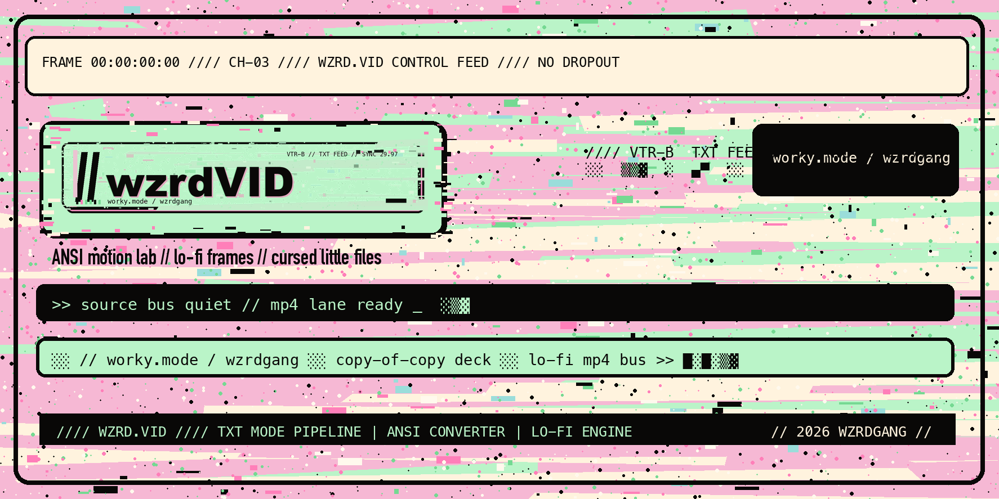

# //wzrdVID

  

**ANSI broadcast lab // lo-fi fragment synthesis // public-access hallucinations**

WZRD.VID is a local-first creative video tool published by AMPYX LLC. This repository is its official public archive, documentation, legal, support, GitHub Pages, and distribution surface. Current desktop application development is private.

## Desktop Release Status

WZRD.VID v0.6.0 for macOS has been approved by Apple and is awaiting the owner's manual release action. It is free to use: no account, subscription, in-app purchases, advertising, tracking, or cloud dependency.

The prepared Mac App Store destination is `https://apps.apple.com/app/id6809168939`. Apple does not expose the public product page until release, so this README and [wzrdvid.com](https://wzrdvid.com/) intentionally keep the Store control non-clickable until the owner releases the approved version.

Direct desktop downloads remain unavailable. All 15 historical release records and tags remain available, but their packaged binary assets have been withdrawn. The latest historical release record is [v0.5.0](https://github.com/wzrdgang/wzrdVID/releases/tag/v0.5.0).

> Historical binary distribution withdrawn. The source tag and release record remain available for historical reference. Previously granted licenses remain unaffected.

GitHub's automatic archive of current `main` contains this public documentation and site snapshot. It is not the desktop application and does not contain current proprietary desktop development source.

Existing lawfully obtained copies are not revoked by the withdrawal. They remain governed by the license that accompanied or applied to that copy.

## Public Repository Contents

- The public website and browser-only [WZRD.VID Lite](https://wzrdvid.com/lite/) experience under [`docs/`](docs/).
- Current AMPYX legal terms, notices, and [license history](docs/LICENSE_HISTORY.md).
- Historical release notes, artifact records, tags, commits, and source history.
- Public issues, discussions, support, and security-reporting channels.

The current desktop application source, build system, tests, release engineering, and Apple wrapper are not part of public `main`. Their removal from the current tree did not rewrite commits, tags, release records, or historical licenses.

## What WZRD.VID Does

Bring your own video, images, and audio. Assemble a timeline or randomized source cut, then shape it with ANSI/text rendering, Material effects, moving Zones, DATAMOSH, SCATTER, previews, and local H.264 MP4 export.

WZRD.VID processes media locally on your Mac. AMPYX LLC develops and publishes WZRD.VID.

## WZRD.VID Lite

[Open WZRD.VID Lite](https://wzrdvid.com/lite/) for the public browser-only 15/30/60-second chaos-cut tool. Files remain local to the browser; there is no upload backend.

Lite is a smaller browser instrument, not the private desktop renderer.

## License And Rights

Current copies that include or expressly reference the [WZRD.VID Freeware License](LICENSE) are proprietary freeware. They may be used without charge for personal, professional, business, paid-client, and commercial creative work, including monetized user output. The license restricts exploitation and unauthorized redistribution of WZRD.VID itself.

AMPYX does not acquire ownership of user media, projects, or output merely because WZRD.VID processes them. Third-party components remain governed by their own licenses.

Historical grants remain valid. The root snapshot used AGPL-3.0, and published tags through v0.5.0 used their historical custom source-available terms. See [LICENSE_HISTORY.md](docs/LICENSE_HISTORY.md), [LICENSE_FAQ.md](docs/LICENSE_FAQ.md), [NOTICE.md](NOTICE.md), and [THIRD_PARTY_NOTICES.md](THIRD_PARTY_NOTICES.md).

## Release History

- [Release records](https://github.com/wzrdgang/wzrdVID/releases)
- [Tags](https://github.com/wzrdgang/wzrdVID/tags)
- [CHANGELOG.md](CHANGELOG.md)
- [v0.3.0 release notes](docs/V0.3.0_RELEASE_NOTES.md)
- [v0.4.0 release notes](docs/V0.4.0_RELEASE_NOTES.md)
- [v0.5.0 release notes](docs/V0.5.0_RELEASE_NOTES.md)

The root [`VERSION`](VERSION) records `0.5.0`, the latest historical GitHub desktop release. The approved App Store build is v0.6.0; this public archive does not contain or announce a downloadable package for it.

## Support And Security

Use [GitHub Issues](https://github.com/wzrdgang/wzrdVID/issues) for bug reports, feature requests, and public support. Use the repository's Discussions area for general project discussion when available.

Report exploitable security issues through a private GitHub security advisory as described in [SECURITY.md](SECURITY.md).

Outside code contributions are not accepted by default. See [CONTRIBUTING.md](CONTRIBUTING.md).
